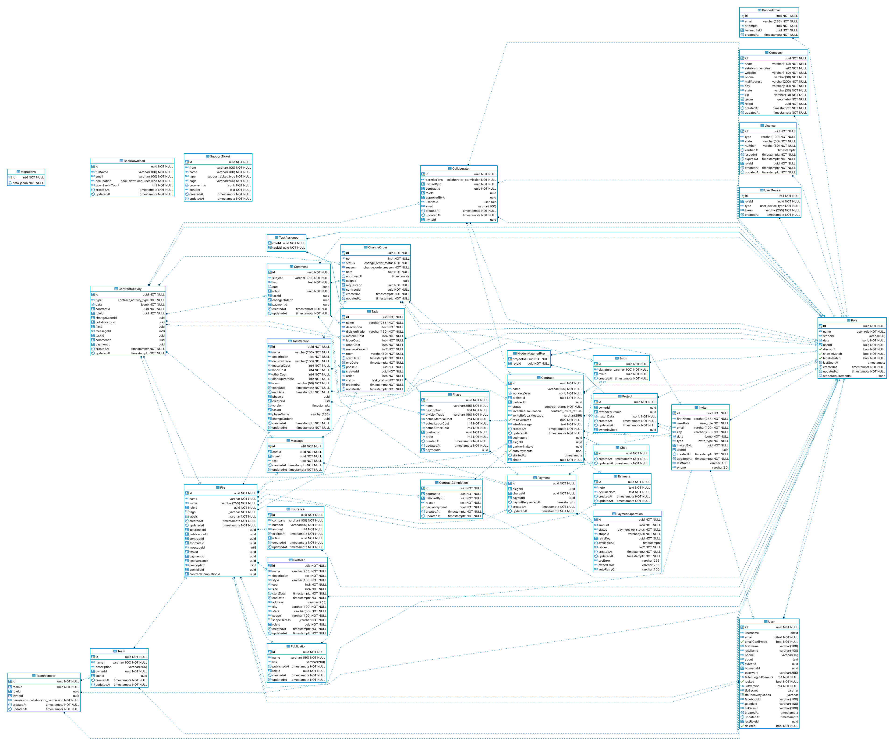

# api-server!

## Installation

### Dependencies

- nodejs v12+
- yarn
- postgres v9.6+
- redis v5+

### PostgreSQL setup

1. Install PostgreSQL
2. `createuser --interactive test_development`
3. `createdb test --owner test_development`

DB GUI – [DBaver](https://dbeaver.io/)



## Deployment

To deploy current changes to the staging just push all the commits to `develop` branch.

To deploy production version:


**IMPORTANT**: When deploying API be careful with breaking changes. UI and Mobile apps rely on the API
and will break if no migration path was created for them.

## Usage

### Migrations

- Create migration: `bin/migrate create <name>`
- Rollback migrations: `bin/migrate down [name-optional]`
- Run migrations(runs automatically on app launch): `bin/migrate up`

### Local Tunnel

To test some features like reply by email you should have local tunnel configured.
[Install](https://blog.alexellis.io/https-inlets-local-endpoints/) [inlets cli](https://github.com/inlets/inlets):
- `curl -sLS https://get.inlets.dev | sudo sh`
Get token from kubectl:
- `export INLETS_TOKEN=$(kubectl get secrets inlets-token -o 'go-template={{index .data "token"}}' -n test-staging | base64 --decode)`
Run client:
- `inlets client --remote wss://inlets.staging.com --upstream=inlets.staging.com=http://127.0.0.1:4100 --token=$INLETS_TOKEN`

### Email Reply test
Add to you `/src/config/local.json` next values:
- `"http": { "host": "https://inlets.staging.com" }`
- `"emails": { "snsTopicArn": "arn:aws:sns:us-west-2:381627165124:email-reply-dev" }`

### Stripe webhooks

Run `bin/stripe` and copy a secret to the `/src/config/test-secrets.json`:

```json
{
  "stripeWebhookSecret": "",
  "stripeConnectWebhookSecret": ""
}
```

## MongoDB version

- `git checkout v1-migration`

## Stripe Upgrades

To run the upgrade:

Staging:
- `test_ENV=staging-com bin/stripe-upgrade 12-01-2019`

Production:
- `test_ENV=test-com bin/stripe-upgrade 12-01-2019`

### [12-01-2019](https://stripe.com/guides/important-update-for-connect)

This upgrade requires update for capabilities of the connected accounts.
Located at [./src/billing/upgrade12-01-2019.ts](./src/billing/upgrade12-01-2019.ts).

## AWS

### [SES](https://aws.amazon.com/ses/)

We use SES for sending and receiving emails.

### [S3](https://aws.amazon.com/s3/)

S3 used only to store received emails.

### [SNS](https://aws.amazon.com/sns/)

SNS topic is used to notify about new received emails.

## [Imgix](https://www.imgix.com/)

Imgix is image resizer and CDN.

## npm packages

- http server: [Polka](https://github.com/lukeed/polka)
- email templates: [mjml](https://mjml.io)
- logger: [pino](https://getpino.io/)
- db driver: [pg](https://node-postgres.com/)
- redis driver: [ioredis](https://github.com/luin/ioredis)
- api: [graphql](https://github.com/graphql/graphql-js)
- background jobs: [Bull](https://github.com/OptimalBits/bull)
  - bull gui: [Bull Arena](https://github.com/bee-queue/arena#readme).
    To run it add to `src/config/local.json`:
    ```json
    { "redis": { "runArena": true } }
    ```
    And open http://localhost:4567.
    To check background jobs on staging or production run:
    - `kubectl get pods -n test-staging`
    - `kubectl port-forward api-server-staging-<hash> 4567:4567 -n test-staging`
    - Open http://localhost:4567

## GraphQL

GraphqQL resolvers are located at `src/gql/resolvers` to replicate the schema:
- queries – `Query/getCurrentUser.ts`
- mutations - `Mutation/login.ts`
etc.

Example: to create a new query `getAllUsers` create file `src/gql/resolvers/Query/getAllUsers.ts`.
```ts
import { defQuery } from '../../';
import { User } from '../../../db/types/user';

defQuery<User[], { arg1: string }>(
  'allUsers(arg1: String!): [User!]!',
  (_root, { arg1 }, ctx) => {
    return ctx.db.getAllUsersByArg1(arg1);
  }
);
```

And import it in the `src/gql/resolvers/index.ts`:
```ts
// …
// Query
import './Query/getAllUsers';
// …
```

Checking the new authentication
